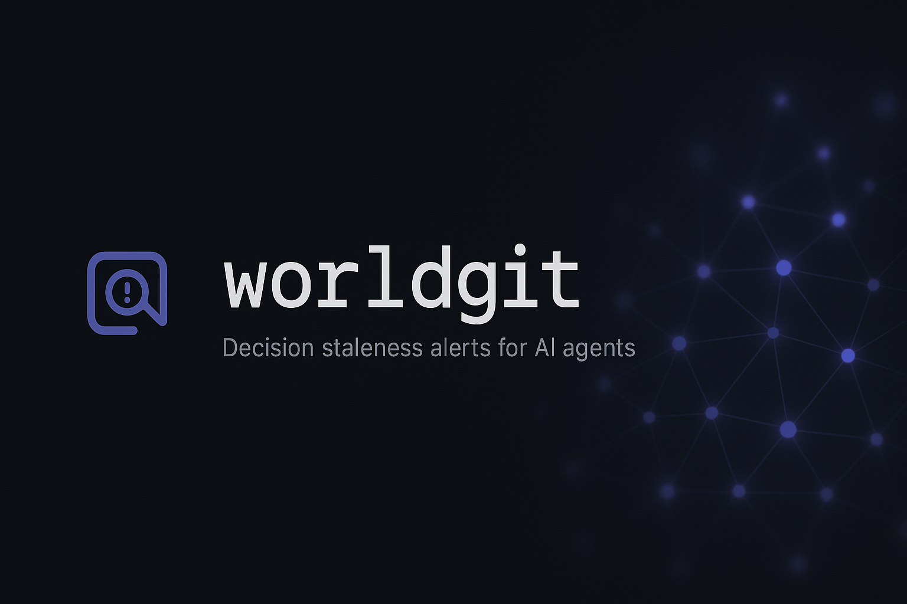
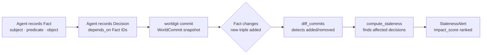

# worldgit

**Decision staleness alerts for AI agents.**



[](https://github.com/sandeep-alluru/worldgit/actions/workflows/ci.yml)
[](https://pypi.org/project/worldgit/)
[](https://pypi.org/project/worldgit/)
[](https://pypi.org/project/worldgit/)
[](LICENSE)
[](https://codecov.io/gh/sandeep-alluru/worldgit)
[](https://mypy-lang.org/)

[Quick Start](#quick-start) · [How It Works](#how-it-works) · [CLI Reference](#cli-reference) · [GitHub Action](#github-action) · [vs. Alternatives](#vs-alternatives) · [Contributing](CONTRIBUTING.md)

---

## Why

AI agents make decisions. Those decisions depend on facts about the world. The world changes.

When the facts an agent depended on are no longer true, its conclusions become **stale** — but nothing tells you which ones, or how much to worry. You either re-run everything (expensive) or trust outdated conclusions (dangerous).

worldgit solves this by treating agent knowledge like source code: every fact and decision is version-controlled, content-addressed, and diff-able. When facts change, worldgit tells you exactly which decisions are affected and how confident you should be about the impact.

```
worldgit stale --exit-code   # Fails CI if any agent decision is based on stale facts
```

---

## How It Works



**Core primitives:**

- **Fact** — an immutable, content-addressed triple `(subject, predicate, object)`. ID = SHA-256[:16] of the triple. Two agents recording the same fact always get the same ID.
- **Decision** — a named agent conclusion that records which Fact IDs it depended on.
- **WorldCommit** — a snapshot of all facts and decisions at a point in time.
- **StalenessAlert** — emitted when a decision's upstream facts have changed, ranked by `impact_score` (confidence-weighted).

Facts and decisions are staged, then committed in batches — exactly like git. `diff_commits()` computes the fact-level delta between two commits, and `compute_staleness()` propagates that delta through the dependency graph in O(changed_facts × avg_decisions_per_fact).

---

## Features

| Feature | Details |
|---------|---------|
| Content-addressed facts | Same triple always produces the same ID — no duplicates |
| Decision dependency graph | Decisions explicitly declare which facts they relied on |
| Staleness propagation | `compute_staleness()` finds all affected decisions in one pass |
| Confidence-weighted impact | `impact_score` reflects how certain the now-stale facts were |
| Offline / local-first | Single SQLite file, no server required |
| CI exit code | `--exit-code` makes `worldgit stale` fail CI if anything is stale |
| JSON output | Machine-readable output for downstream automation |
| Markdown output | Ready-to-paste GitHub PR comment |
| FastAPI REST server | `/fact`, `/decide`, `/commit`, `/stale`, `/log` endpoints |
| MCP server | Model Context Protocol integration for Claude and other agents |
| 43 tests | Comprehensive test suite covering all layers |

---

## Quick Start

```bash
pip install worldgit
```

```python
from worldgit.repo import WorldRepo

repo = WorldRepo.init(".worldgit/world.db")

# Record facts your agent is relying on
f = repo.add_fact("Redis", "is-appropriate-for", "rate-limiting", confidence=0.95)
pg = repo.add_fact("Postgres", "is-primary-db", "yes")

# Record a decision that depends on those facts
repo.decide(
    "chose-redis-for-rate-limiting",
    "Redis is fast enough for our rate-limiting needs at current scale.",
    depends_on=[f.id],
)

commit = repo.commit("Initial architecture decisions")
print(commit.id)  # e.g. "a3f8b2c1d4e5f6a7"

# Later — the world changed
repo.add_fact("Redis", "replaced-by", "Valkey")
repo.commit("Redis EOL notice")

# Which decisions are now stale?
alerts = repo.stale()
for alert in alerts:
    print(f"STALE: {alert.decision_label} (impact: {alert.impact_score:.0%})")
```

---

## CLI Reference

```bash
worldgit [--db PATH] COMMAND [OPTIONS]
```

| Command | Description | Key options |
|---------|-------------|-------------|
| `fact SUBJECT PREDICATE OBJECT` | Stage a new fact triple | `--confidence FLOAT` |
| `decide LABEL CONTENT` | Stage a decision | `--on FACT_ID` (repeatable) |
| `commit` | Commit all staged items | `-m MESSAGE` (required) |
| `stale` | Show stale decisions | `--since COMMIT_ID`, `--format {rich,json,markdown}`, `--exit-code` |
| `diff` | Show fact changes between HEAD and parent | `--format {rich,json,markdown}` |
| `log` | Show commit history | — |
| `status` | Show staged item count and HEAD | — |

**Global options:**

| Option | Default | Env var |
|--------|---------|---------|
| `--db PATH` | `.worldgit/world.db` | `WORLDGIT_DB` |

**Examples:**

```bash
# Stage facts
worldgit fact Redis is-appropriate-for rate-limiting
worldgit fact Postgres is-primary-db yes --confidence 0.9

# Stage a decision that depends on the Redis fact
worldgit decide chose-redis "Redis fits our rate-limiter requirements" \
    --on a3f8b2c1d4e5f6a7

# Commit
worldgit commit -m "Initial architecture decisions"

# Check for staleness (machine-readable)
worldgit stale --format json

# Fail CI if anything is stale
worldgit stale --exit-code
```

---

## GitHub Action

Add worldgit staleness checks to your CI pipeline:

```yaml
# .github/workflows/worldgit.yml
name: worldgit staleness check
on: [push, pull_request]

jobs:
  stale:
    runs-on: ubuntu-latest
    steps:
      - uses: actions/checkout@v4
      - uses: sandeep-alluru/worldgit@main
        with:
          db: .worldgit/world.db
          fail-on-stale: "true"
```

The action installs worldgit, runs `worldgit stale --exit-code`, and fails the job if any decisions are stale. See [docs/github-action.md](docs/github-action.md) for full documentation.

---

## vs. Alternatives

| | worldgit | Graphiti / Zep | Letta / Mem0 | Memoria | LangGraph checkpointing |
|---|---|---|---|---|---|
| **Decision-dependency tracking** | Yes — explicit fact IDs per decision | No | No | No | No |
| **Staleness alerts** | Yes — ranked by impact_score | No | No | No | No |
| **Content-addressed facts** | Yes — SHA-256[:16] | No | No | No | No |
| **Offline / local** | Yes — single SQLite file | Requires Neo4j/Redis | Requires server | No | Partial |
| **CI exit code** | Yes — `--exit-code` flag | No | No | No | No |
| **Primary purpose** | Decision staleness tracking | Long-term agent memory | Personalized memory | In-context memory | State persistence |
| **Graph storage** | Dependency edges only | Full knowledge graph | Vector + metadata | In-context only | State snapshots |
| **Open source** | MIT | Open core | Open core | MIT | Apache 2.0 |

worldgit is not a general-purpose agent memory system. It is specifically designed to answer: *"Given that these facts changed, which agent decisions are now invalid?"*

---

## Claude / MCP integration

worldgit ships a Model Context Protocol server that lets Claude and other MCP-compatible agents record facts and decisions directly:

```bash
# Start the MCP server
python -m worldgit.mcp_server

# In your Claude Code project's .claude/settings.json:
{
  "mcpServers": {
    "worldgit": {
      "command": "python",
      "args": ["-m", "worldgit.mcp_server"]
    }
  }
}
```

Once connected, Claude can call `worldgit/fact`, `worldgit/decide`, `worldgit/commit`, and `worldgit/stale` as tools. See [docs/mcp.md](docs/mcp.md) for the full tool schema.

---

## OpenAI integration

worldgit exposes a FastAPI REST server compatible with OpenAI's function-calling format. The tool definitions are in [`tools/openai-tools.json`](tools/openai-tools.json) and the full API spec is in [`openapi.yaml`](openapi.yaml).

```bash
# Start the REST server
uvicorn worldgit.api:app --reload

# Pass to Codex CLI or any OpenAI-compatible agent
codex --tools tools/openai-tools.json "Check which architecture decisions are stale"
```

Endpoints: `GET /health`, `POST /fact`, `POST /decide`, `POST /commit`, `GET /stale`, `GET /log`. See [docs/openai.md](docs/openai.md) for details.

---

## Repository structure

```
worldgit/
├── src/
│   └── worldgit/
│       ├── fact.py           # Fact, Decision, StalenessAlert dataclasses
│       ├── store.py          # SQLite-backed WorldStore + WorldCommit
│       ├── staleness.py      # DiffResult, diff_commits(), compute_staleness()
│       ├── repo.py           # WorldRepo high-level API
│       ├── report.py         # print_stale(), print_diff(), to_json(), to_markdown()
│       ├── cli.py            # Click CLI (fact, decide, commit, stale, diff, log, status)
│       ├── api.py            # FastAPI REST server
│       └── mcp_server.py     # MCP server
├── tests/
│   ├── test_fact.py          # Fact, Decision, StalenessAlert unit tests
│   ├── test_store.py         # WorldStore + WorldCommit tests
│   ├── test_staleness.py     # Staleness propagation tests
│   ├── test_repo.py          # WorldRepo integration tests
│   └── test_cli.py           # CLI subprocess integration tests
├── examples/
│   └── demo.py               # Standalone demo script
├── docs/                     # MkDocs documentation
├── tools/
│   └── openai-tools.json     # OpenAI function-calling tool definitions
├── assets/
│   ├── hero.png              # README hero image
│   └── logo.png              # Project logo
├── action.yml                # GitHub Action
├── openapi.yaml              # OpenAPI 3.1 spec
├── pyproject.toml            # Package metadata + dependencies
└── CONTRIBUTING.md           # Contribution guide
```

---

## GitHub Topics

Suggested topics for discoverability:

`ai-agents` `decision-tracking` `staleness-detection` `knowledge-graph` `sqlite` `mcp` `openai` `langchain` `llm-tools` `agent-memory` `fact-tracking` `ci-cd` `python`

---

[](https://star-history.com/#sandeep-alluru/worldgit&Date)
